  <a href="https://leonlimwf.com"><strong>Portfolio</strong></a> ·
  <a href="https://www.linkedin.com/in/leonlimwf"><strong>LinkedIn</strong></a> ·
  <a href="mailto:leonlimwf@gmail.com"><strong>Email</strong></a>

---

## Featured projects

### [OrderEase](https://orderease.app/) — commerce infrastructure for Singapore's home businesses

A live SaaS platform serving **40+ Singapore micro-merchants** with branded storefronts, bookings, order management, and PayNow checkout. Built end to end with server-authoritative pricing, idempotency safeguards, field-level PII encryption, atomic transactions, and Stripe subscriptions.

**React · TypeScript · tRPC · Hono · SQL · SSE · Stripe** 
[Live product](https://orderease.app/) · [Engineering case study](https://leonlimwf.com/blog/5)

### RideSense — explainable pricing intelligence for Singapore's used-car market

A data and ML system that collects and normalises **14,000+ vehicle listings**. Its depreciation model uses validation tracking and confidence bands so estimates communicate uncertainty instead of presenting one opaque number.

**Python · FastAPI · MongoDB · Next.js · Recharts** 

### [Apple Refurbished Tracker](https://github.com/leonlimwf/apple_scraper) — inventory and price-history monitoring

A public full-stack project that tracks Apple's refurbished inventory in Singapore. It runs automated daily collection, records price history in SQLite, and provides filtering and watchlists through a React interface.

**TypeScript · React · Hono · SQLite · Tailwind CSS · Docker** 
[View source](https://github.com/leonlimwf/apple_scraper)

## Stack

| Area | Tools |
| --- | --- |
| Product engineering | TypeScript, React, Next.js, Vite, Tailwind CSS |
| Backend and APIs | Node.js, Hono, tRPC, FastAPI, Express, REST APIs |
| Data and ML | Python, SQL, PostgreSQL, MongoDB, Prisma, ML pipelines |
| Systems | Docker, Linux/Bash, Git CI/CD, self-hosting, MQTT and IoT protocols |

## Engineering notes

[**Building OrderEase: What I Learned Serving Singapore's Micro-Merchants**](https://leonlimwf.com/blog/5) 
The tradeoffs behind using SQLite, tRPC, PayNow, and Stripe for a focused commerce product.

[Read all notes →](https://leonlimwf.com/blog)

## GitHub activity

<!-- Generated automatically by .github/workflows/profile-3d.yml -->

<strong>View contribution snake</strong>

 

<!-- Generated automatically by .github/workflows/snake.yml -->
<picture>
  <source media="(prefers-color-scheme: dark)" srcset="https://raw.githubusercontent.com/leonlimwf/leonlimwf/output/github-contribution-grid-snake-dark.svg" />
  <source media="(prefers-color-scheme: light)" srcset="https://raw.githubusercontent.com/leonlimwf/leonlimwf/output/github-contribution-grid-snake.svg" />
  
</picture>

[View all projects](https://leonlimwf.com/#projects) · [Browse my repositories](https://github.com/leonlimwf?tab=repositories) · [Get in touch](mailto:leonlimwf@gmail.com)

