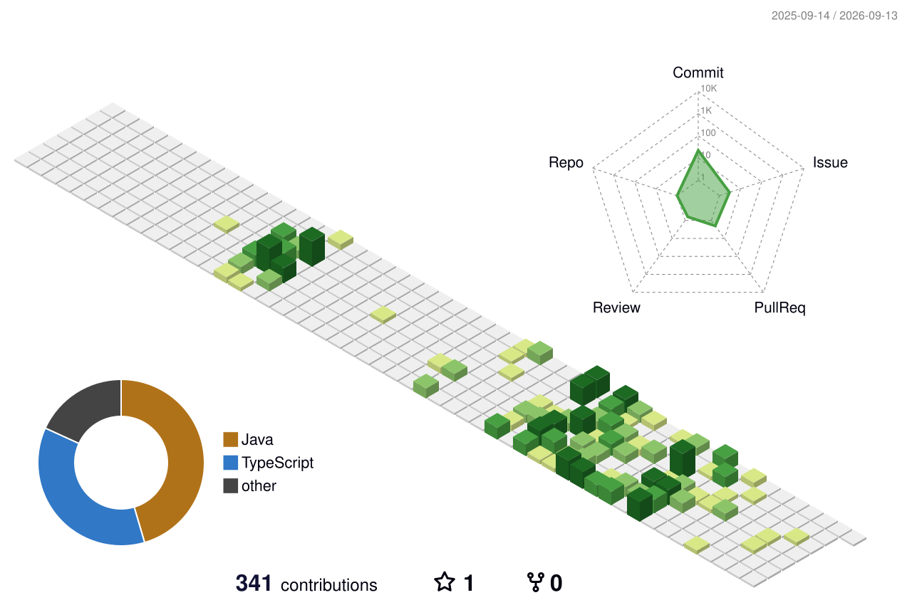

 

---

## 👨‍💻 About Me

I'm a **Computer Science undergraduate at Nanyang Technological University** and a **Diploma with Merit in Big Data & Analytics** graduate from Temasek Polytechnic.

I build practical products across the full stack — from frontend experiences and backend APIs to machine-learning systems, deployment, and production operations.

- 🚀 Building **[OrderEase](https://orderease.app)**, a commerce and order-management platform for Singapore home businesses
- 🧩 Interested in full-stack engineering, scalable systems, developer tooling, applied AI, and product development
- 🛠️ Comfortable working across product design, frontend, backend, data, infrastructure, and deployment
- 🎯 Open to **Summer 2027 software engineering and applied AI internships**
- 📍 Based in Singapore

> More about my experience and projects: **[leonlimwf.com](https://leonlimwf.com)**

## 🚀 Featured Work

<table>
<tr>
<td width="50%" valign="top">

### [OrderEase](https://orderease.app)

**Commerce & order management for Singapore home businesses**

A production SaaS platform that helps sellers manage storefronts, products, inventory, orders, bookings, customers, fulfilment, promotions, payments, and loyalty rewards.

**What I worked on**

- Product architecture and end-to-end user flows
- Type-safe frontend and backend development
- Real-time order updates and operational workflows
- Production deployment, CI/CD, monitoring, and reliability

  
  
  
  
  

</td>
<td width="50%" valign="top">

### Used-Car Price Intelligence

**Machine-learning decision support for Singapore car buyers**

An end-to-end application that analyses used-car listings, estimates fair market value, surfaces comparable vehicles, and explains the result in understandable terms.

**Highlights**

- Trained models on approximately **18,000 listings**
- Engineered vehicle age, mileage, ownership, engine, brand, and market features
- Combined scraping, prediction, retrieval, recommendations, and AI-generated explanations
- Deployed a full-stack interface around the modelling workflow

  
  
  
  
  

</td>
</tr>
<tr>
<td width="50%" valign="top">

### Edge AI & Computer Vision

Previously developed software and AI integrations involving **face recognition, fall detection, edge devices, and live video streams**.

- Built MERN-based portals
- Integrated computer-vision services into application workflows
- Worked with NVIDIA Jetson, DeepStream, GStreamer, RTSP, and Docker
- Supported deployments spanning application and edge environments

</td>
<td width="50%" valign="top">

### What I'm Exploring

- Scalable multi-tenant application architecture
- Reliable real-time notification systems
- AI-assisted testing and developer workflows
- Product analytics and onboarding optimisation
- Infrastructure, containers, and production operations

</td>
</tr>
</table>

## 🧰 Tech Stack

### Product Engineering

### Backend, Data & Infrastructure

## 🏆 Highlights

- **Top 10**, PSA CodeSprint 2021
- Temasek Polytechnic **Scholarship** recipient
- Temasek Polytechnic **Director's List**
- Student mentor for computational thinking, cybersecurity, and machine-learning subjects
- Experience building and deploying full-stack, data, and AI-powered applications

## 📊 GitHub Activity

## 🌱 Contribution Skyline

<!-- Generated automatically by .github/workflows/profile-3d.yml -->

## 🐍 Contribution Trail

<!-- Generated automatically by .github/workflows/snake.yml -->
<picture>
  <source media="(prefers-color-scheme: dark)" srcset="https://raw.githubusercontent.com/leonlimwf/leonlimwf/output/github-contribution-grid-snake-dark.svg" />
  <source media="(prefers-color-scheme: light)" srcset="https://raw.githubusercontent.com/leonlimwf/leonlimwf/output/github-contribution-grid-snake.svg" />
  
</picture>

## 🤝 Connect With Me

I'm always interested in conversations about software products, engineering, data, applied machine learning, and startup ideas.

 

 

